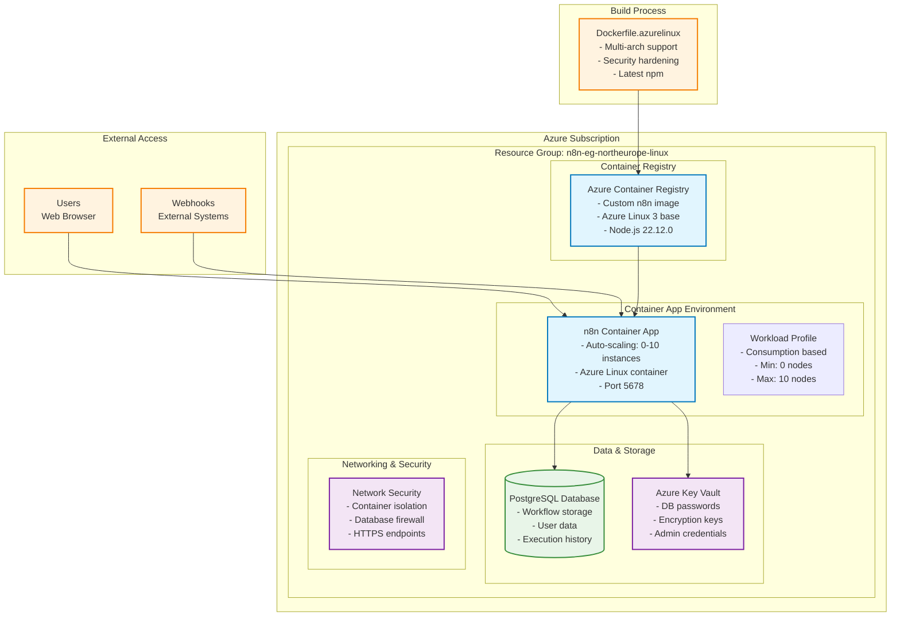
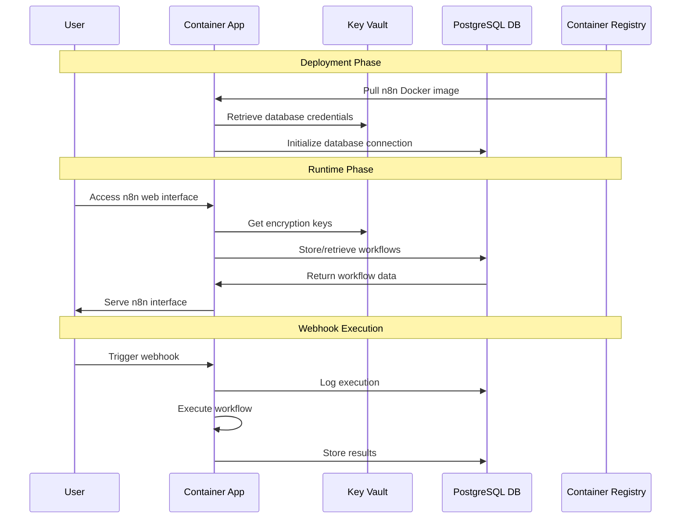
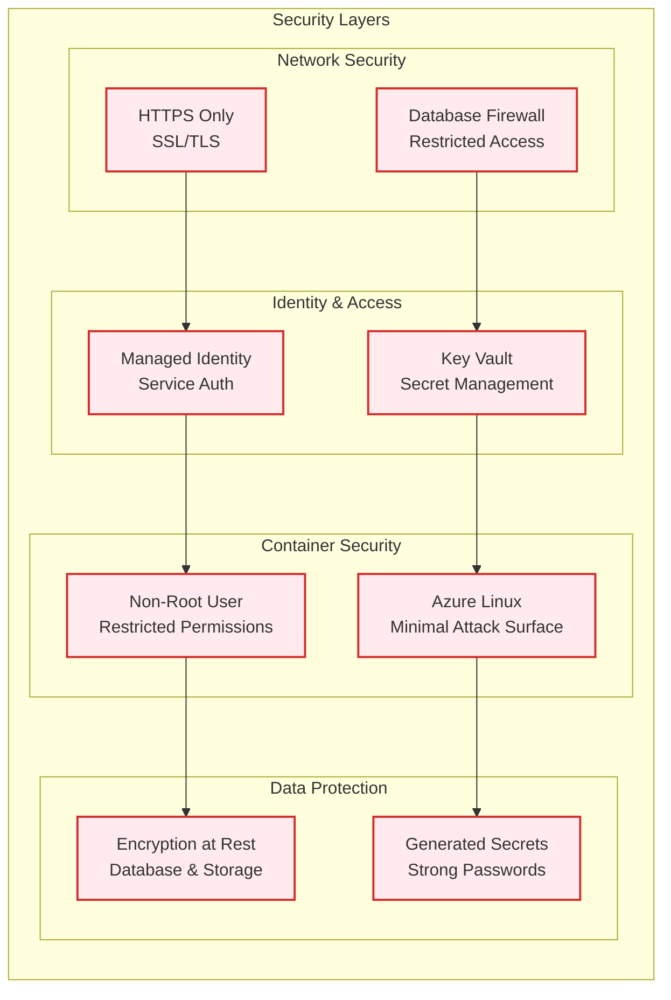

# n8n on Azure Container Apps - Complete Installation Guide

Welcome to the comprehensive guide for deploying n8n (a powerful workflow automation platform) on Azure Container Apps using Azure Linux. This tutorial will walk you through every step of the process, from prerequisites to a fully functional n8n deployment.

## 📋 Table of Contents

1. [Prerequisites](#prerequisites)
2. [Understanding the Architecture](#understanding-the-architecture)
3. [Before You Begin](#before-you-begin)
4. [Step 1: Prepare Your Environment](#step-1-prepare-your-environment)
5. [Step 2: Create Container App Environment](#step-2-create-container-app-environment)
6. [Step 3: Build the n8n Docker Image](#step-3-build-the-n8n-docker-image)
7. [Step 4: Deploy n8n Container App](#step-4-deploy-n8n-container-app)
8. [Step 5: Access and Configure n8n](#step-5-access-and-configure-n8n)
9. [Troubleshooting](#troubleshooting)
10. [Security Considerations](#security-considerations)
11. [Cost Optimization](#cost-optimization)

---

## 🔧 Prerequisites

Before starting this tutorial, ensure you have:

### Required Tools
- **Azure CLI** (version 2.15.0 or later)
- **Docker** (for local testing - optional)
- **Bash shell** (Linux, macOS, or Windows WSL)
- **Text editor** (VS Code recommended)

### Azure Requirements
- **Active Azure subscription** with sufficient permissions
- **Contributor role** on the subscription or resource group
- **Ability to create** resource groups, container registries, and container apps

### Technical Knowledge
- Basic familiarity with command line operations
- Understanding of Docker containers (helpful but not required)
- Basic Azure concepts (resource groups, regions)

---

## 🏗️ Understanding the Architecture

Our n8n deployment will consist of multiple Azure services working together to provide a secure, scalable, and production-ready workflow automation platform.

### Architecture Overview



### Component Details

**Key Components:**
- **Azure Container Registry (ACR)**: Stores our custom n8n Docker image built with Azure Linux 3
- **Container App Environment**: Manages the runtime environment with auto-scaling capabilities
- **n8n Container App**: The main application running in a secure, non-root container
- **PostgreSQL Database**: Persistent storage for workflows, executions, and user data
- **Azure Key Vault**: Centralized secret management for passwords and encryption keys
- **Workload Profile**: Consumption-based scaling configuration (0-10 instances)

### Data Flow



### Security Architecture



---

## 🚀 Before You Begin

### Choose Your Azure Region

Select an Azure region close to your users for better performance. Common choices:
- **North Europe** (`northeurope`) - for European users
- **East US** (`eastus`) - for North American users  
- **Southeast Asia** (`southeastasia`) - for Asian users

For a full ist of supported regions see [here](https://azure.microsoft.com/en-us/pricing/details/container-apps/?msockid=02d8b66a6b5f634a3bcaa3056a2262f5#pricing)

### Naming Convention

We'll use this naming pattern:
- Resource Group: `n8n-eg-[region]-linux`
- Environment: `n8n-env`
- Container App: `my-n8n-app`
- Container Registry: `[unique-name]acr`

---

## 📝 Step 1: Prepare Your Environment

### 1.1 Login to Azure

Open your terminal and login to Azure:

```bash
az login
```

This will open a browser window for authentication. After successful login, you'll see your subscription details.

### 1.2 Set Your Default Subscription

If you have multiple subscriptions, set the one you want to use:

```bash
# List available subscriptions
az account list --output table

# Set your subscription (replace with your subscription ID)
az account set --subscription "your-subscription-id"
```

### 1.3 Install Container Apps Extension

Install the Azure Container Apps extension:

```bash
az extension add --name containerapp --upgrade
```

### 1.4 Register Required Providers

Register the necessary Azure providers:

```bash
az provider register --namespace Microsoft.App
az provider register --namespace Microsoft.OperationalInsights
az provider register --namespace Microsoft.DBforPostgreSQL
az provider register --namespace Microsoft.KeyVault
az provider register --namespace Microsoft.ContainerRegistry
```

---

## 🏗️ Step 2: Create Container App Environment

This step creates the foundational infrastructure for your n8n deployment.

### 2.1 Configure Variables

Open the script `1_create_workload_profile.sh` and customize these variables:

```bash
# Edit these values according to your preferences
RESOURCE_GROUP="n8n-eg-northeurope-linux"  # Your resource group name
LOCATION="northeurope"                      # Your preferred Azure region
WORKLOAD_PROFILE_NAME="n8n-workload-profile"
ENV_NAME="n8n-env"
```

**What each variable means:**
- `RESOURCE_GROUP`: Container for all your n8n resources
- `LOCATION`: Azure region where resources will be created
- `WORKLOAD_PROFILE_NAME`: Defines compute resources for your container
- `ENV_NAME`: Environment that hosts your container apps

### 2.2 Run the Environment Creation Script

Execute the script to create your infrastructure:

```bash
# Make the script executable
chmod +x 1_create_workload_profile.sh

# Run the script
./1_create_workload_profile.sh
```

**What this script does:**

1. **Validates Configuration**: Ensures all required variables are set
2. **Creates Resource Group**: A logical container for all your resources
3. **Creates Container App Environment**: The runtime environment for your n8n app
4. **Configures Workload Profile**: Sets up consumption-based scaling (0-10 nodes)
5. **Verifies Setup**: Confirms everything was created successfully

**Expected Output:**
```
[Wed Jan 15 10:30:45 UTC 2025] Starting workload profile creation script...
[Wed Jan 15 10:30:45 UTC 2025] Validating required variables...
[Wed Jan 15 10:30:45 UTC 2025] Variable validation completed.
[Wed Jan 15 10:30:46 UTC 2025] Creating resource group 'n8n-eg-northeurope-linux'...
[Wed Jan 15 10:30:48 UTC 2025] Resource group creation completed.
[Wed Jan 15 10:30:48 UTC 2025] Creating container app environment 'n8n-env'...
[Wed Jan 15 10:31:25 UTC 2025] Container app environment creation completed.
```

---

## 🐳 Step 3: Build the n8n Docker Image

Now we'll build a custom n8n Docker image optimized for Azure Linux.

### 3.1 Understanding the Dockerfile

Our custom `Dockerfile.azurelinux` provides:
- **Azure Linux 3 base**: Optimized for Azure workloads
- **Node.js 22.12.0**: Meets n8n's requirements (>=20.19 <= 24.x)
- **Security hardening**: Non-root user, proper permissions
- **Architecture support**: Works on both x64 and ARM64

### 3.2 Configure Build Variables

Open `2_build_image.sh` and customize these variables:

```bash
# Edit these values
ACR_NAME="your-unique-acr-name"  # Must be globally unique (alphanumeric only)
IMAGE_NAME="n8n-azure"           # Your image name
RESOURCE_GROUP="n8n-eg-northeurope-linux"  # Same as step 2
LOCATION="northeurope"           # Same as step 2
DOCKERFILE_PATH="Dockerfile.azurelinux"  # Change to your Dockerfile path (default: Dockerfile)
```

**Important Notes:**
- `ACR_NAME` must be globally unique across all of Azure
- Use only lowercase letters and numbers (no hyphens or special characters)
- Choose something like `[yourname]n8nacr` or `[company]n8nacr`

### 3.3 Run the Build Script

Execute the image build process:

```bash
# Make the script executable
chmod +x 2_build_image.sh

# Run the script
./2_build_image.sh
```

**What this script does:**

1. **Validates Configuration**: Checks all required variables and files
2. **Creates Azure Container Registry**: If it doesn't already exist
3. **Builds Docker Image**: Uses Azure Container Registry build service
4. **Pushes to Registry**: Makes the image available for deployment
5. **Verifies Build**: Confirms the image was built successfully

**Build Process Details:**
- Uses Azure's cloud build service (faster than local builds)
- Automatically detects architecture (x64/ARM64)
- Installs latest npm version
- Creates secure, non-root container

**Expected Output:**
```
[Wed Jan 15 10:35:00 UTC 2025] Starting Azure Container Registry build script...
[Wed Jan 15 10:35:01 UTC 2025] Validating required variables...
[Wed Jan 15 10:35:01 UTC 2025] Creating Azure Container Registry 'yourn8nacr'...
[Wed Jan 15 10:35:15 UTC 2025] Starting container image build...
[Wed Jan 15 10:38:42 UTC 2025] Build completed successfully!
```

---

## 🚀 Step 4: Deploy n8n Container App

This is the final deployment step that creates your running n8n application.

### 4.1 Configure Deployment Variables

Open `3_deploy_container_app.sh` and customize these critical variables:

```bash
# Application Configuration
CONTAINER_APP_NAME="my-n8n-app"              # Your app name
LOCATION="northeurope"                       # Same as previous steps
RESOURCE_GROUP="n8n-rg-northeurope"         # Resource group name
ACR_NAME="yourn8nacr"                        # Same ACR name from step 3
IMAGE_NAME="n8n-azure"                       # Same image name from step 3

# Database Configuration
DB_SERVER_NAME="your-n8n-db-server"         # Unique database server name
DB_ADMIN_USER="n8n_admin"                   # Database admin username
DB_NAME="n8n"                               # Database name

# n8n Configuration
N8N_DOMAIN="your-domain.com"                # Your domain (or use provided URL later)
N8N_USERNAME="admin"                        # n8n admin username
KEYVAULT_NAME="your-n8n-kv"                 # Unique Key Vault name
```

**Security Note**: The script automatically generates secure passwords and encryption keys.

### 4.2 Run the Deployment Script

Execute the final deployment:

```bash
# Make the script executable
chmod +x 3_deploy_container_app.sh

# Run the script
./3_deploy_container_app.sh
```

**What this script does:**

1. **Generates Security Keys**: Creates secure passwords and encryption keys
2. **Creates PostgreSQL Database**: Sets up persistent storage for n8n
3. **Creates Azure Key Vault**: Securely stores all secrets
4. **Configures Database Access**: Sets up firewall rules and connection strings
5. **Deploys Container App**: Launches n8n with proper configuration
6. **Sets up Environment Variables**: Configures n8n for production use
7. **Provides Access Information**: Shows you how to access your deployment

**Expected Output:**
```
[Wed Jan 15 10:45:00 UTC 2025] Starting n8n Container App deployment script...
[Wed Jan 15 10:45:01 UTC 2025] Creating PostgreSQL database server...
[Wed Jan 15 10:47:30 UTC 2025] Creating Azure Key Vault...
[Wed Jan 15 10:48:15 UTC 2025] Deploying n8n Container App...
[Wed Jan 15 10:52:40 UTC 2025] Deployment completed successfully!

🎉 n8n has been successfully deployed!

📍 Access your n8n instance at: https://my-n8n-app.proudwater-12345678.northeurope.azurecontainerapps.io
👤 Username: admin
🔑 Password: [auto-generated secure password]
```

---

## 🌐 Step 5: Access and Configure n8n

### 5.1 Initial Access

1. **Open the provided URL** in your web browser
2. **Login with the credentials** shown in the deployment output
3. **Accept any security warnings** (we'll set up proper SSL later)

### 5.2 First-Time Setup

When you first access n8n, you'll see the setup wizard:

1. **Owner Account Setup**:
   - Use the username from deployment output
   - Use the auto-generated password
   - Provide your email address

2. **Instance Configuration**:
   - Choose your preferred settings
   - Enable/disable usage analytics as desired
   - Configure your timezone

### 5.3 Configure Domain (Optional)

To use a custom domain:

1. **Point your domain** to the Container App URL using a CNAME record
2. **Update the n8n configuration** with your domain
3. **Configure SSL** through Azure Front Door or Application Gateway

### 5.4 Basic Security Configuration

1. **Change Default Password**: Go to Settings > Users and update the admin password
2. **Configure Basic Auth**: Set `N8N_BASIC_AUTH_ACTIVE=true` if not already enabled
3. **Review Environment Variables**: Check Settings > Environment for proper configuration

---

## 🔧 Troubleshooting

### Common Issues and Solutions

#### Issue: "ACR name already exists"
**Solution**: Choose a different, globally unique ACR name in `2_build_image.sh`

#### Issue: "Container app not accessible"
**Solution**: 
1. Check if the deployment completed successfully
2. Verify the Container App is running: `az containerapp show --name my-n8n-app --resource-group [your-rg]`
3. Check container logs: `az containerapp logs show --name my-n8n-app --resource-group [your-rg]`

#### Issue: "Database connection failed"
**Solution**:
1. Verify PostgreSQL server is running
2. Check if Key Vault secrets are properly configured
3. Ensure database firewall allows Container App access

#### Issue: "Build fails with architecture error"
**Solution**: The Dockerfile automatically detects architecture, but if it fails:
1. Check if you're using the latest version of `Dockerfile.azurelinux`
2. Ensure all required packages (tar, xz) are available

### Useful Debugging Commands

```bash
# Check Container App status
az containerapp show --name my-n8n-app --resource-group [your-rg] --output table

# View container logs
az containerapp logs show --name my-n8n-app --resource-group [your-rg] --follow

# Check database server status
az postgres server show --name [your-db-server] --resource-group [your-rg]

# List Key Vault secrets
az keyvault secret list --vault-name [your-kv-name] --output table
```

---

## 🔒 Security Considerations

### Production Security Checklist

- [ ] **Change default passwords** immediately after deployment
- [ ] **Enable HTTPS** using a custom domain and SSL certificate
- [ ] **Configure network restrictions** to limit access to trusted IPs
- [ ] **Enable Azure Monitor** for logging and alerting
- [ ] **Set up backup strategies** for your workflows and data
- [ ] **Review Key Vault access policies** to ensure least privilege
- [ ] **Enable database auditing** for compliance requirements

### Security Features Included

✅ **Non-root container execution**
✅ **Encrypted database connections**
✅ **Secure secret management with Key Vault**
✅ **Auto-generated strong passwords**
✅ **Network isolation with Container Apps**
✅ **Azure-managed SSL certificates**

---

## 💰 Cost Optimization

### Understanding Costs

**Container Apps**: Pay only when your app is running
- **Consumption plan**: $0.000024/vCPU-second + $0.000003/GiB-second
- **Typical n8n usage**: ~$10-30/month for light usage

**PostgreSQL Database**: Always-on service
- **Basic tier**: Starting at ~$25/month
- **Consider** Flexible Server for better pricing

**Container Registry**: Storage and bandwidth costs
- **Basic tier**: $5/month + data transfer costs

### Cost Optimization Tips

1. **Use consumption workload profile** (already configured)
2. **Set appropriate scaling limits** (0-10 nodes configured)
3. **Monitor usage** with Azure Cost Management
4. **Consider database tier** based on your needs
5. **Use Azure reservations** for predictable workloads

---

## 🎉 Conclusion

Congratulations! You've successfully deployed n8n on Azure Container Apps with:

✅ **Secure, production-ready configuration**
✅ **Automatic scaling from 0 to 10 instances**
✅ **Persistent PostgreSQL database storage**
✅ **Secure secret management**
✅ **Custom Azure Linux-based container**

### Next Steps

1. **Explore n8n**: Create your first workflows
2. **Set up monitoring**: Configure Azure Monitor alerts
3. **Backup strategy**: Plan for data protection
4. **Custom domain**: Configure your own domain name
5. **Integration**: Connect n8n to your existing services

### Getting Help

- **n8n Documentation**: https://docs.n8n.io
- **Azure Container Apps Docs**: https://docs.microsoft.com/azure/container-apps
- **Community Support**: n8n Community Forum
- **Azure Support**: Azure Portal support tickets

---

## 📚 Additional Resources

- [n8n Official Documentation](https://docs.n8n.io)
- [Azure Container Apps Documentation](https://docs.microsoft.com/azure/container-apps)
- [Azure Linux Documentation](https://github.com/microsoft/azurelinux)
- [Docker Best Practices](https://docs.docker.com/develop/dev-best-practices/)

---

*This tutorial was created to provide a comprehensive, step-by-step guide for deploying n8n on Azure Container Apps. If you encounter any issues or have suggestions for improvement, please refer to the troubleshooting section or seek community support.*
